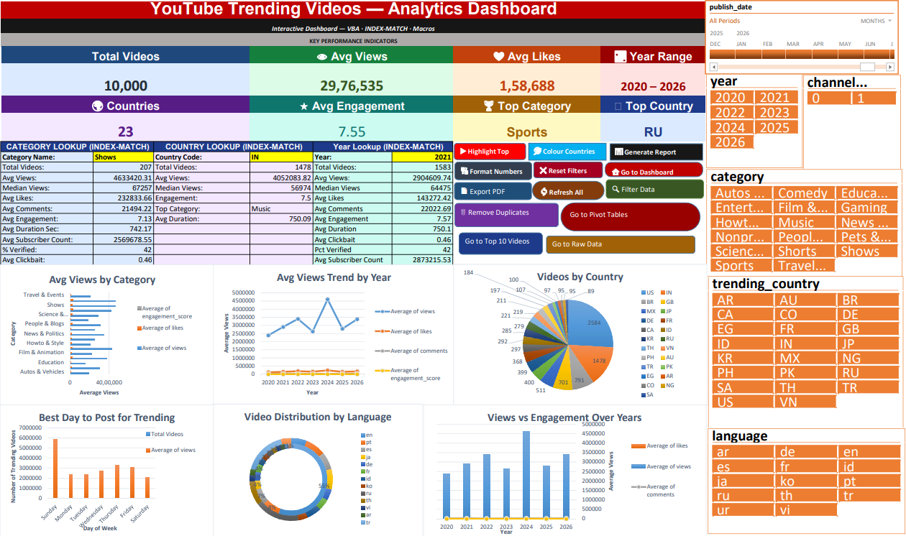
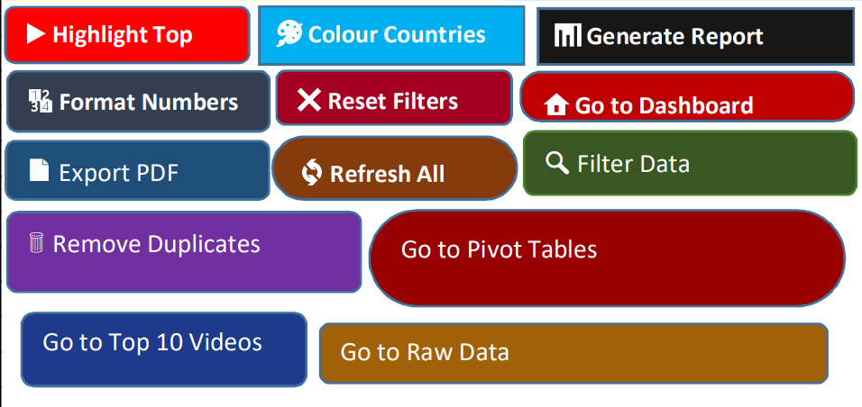

# 📊 YouTube Trending Videos Analytics
# Dashboard (2020–2026)

## 🎯 Project Overview
A fully interactive Excel Dashboard
analyzing 10,000 YouTube trending videos
across 23 countries from 2020 to 2026

Built to answer real questions:
- 🏆 Which category gets most views?
- 🌍 Which country dominates trending?
- 📅 What is the best day to post?
- 💰 Does engagement affect views?
- 📈 How have trends changed yearly?
---
## 🤯 Key Insights

| Insight | Value |
|---|---|
| Total Videos Analyzed | 10,000 |
| Total Countries | 23 |
| Time Period | 2020 – 2026 |
| Top Category by Views | Sports |
| Top Country by Views | Russia (RU) |
| Avg Views | 29,76,535 |
| Avg Likes | 1,58,688 |
| Avg Engagement Score | 7.55 |
| Peak Year for Views | 2022 (34,00,969) |
| Top Category Globally | Music |

---

## ✅ Dashboard Features

### 📊 8 KPI Cards
- Total Videos → 10,000
- Avg Views → 29,76,535
- Avg Likes → 1,58,688
- Year Range → 2020 – 2026
- Total Countries → 23
- Avg Engagement → 7.55
- Top Category → Sports
- Top Country → RU

### 🔍 3 INDEX-MATCH Lookup Panels
- Category Lookup Panel
- Country Lookup Panel
- Year Lookup Panel
- All with dropdown validation

### 📈 6 Interactive Charts
- Bar Chart → Avg Views by Category
- Line Chart → Yearly Trend
- Pie Chart → Videos by Country
- Column Chart → Engagement by Category
- Doughnut Chart → Language Distribution
- Combo Chart → Views vs Engagement

### 📅 Best Day to Post Chart
- Day of week analysis
- Total videos per day
- Avg views per day
- Avg engagement per day

### 🔽 4 Slicers + Timeline
- Year Slicer
- Country Slicer
- Language Slicer
- Category Slicer
- publish_date Timeline

### ⚡ 10 VBA Macros
- Highlight Top Performers
- Export Dashboard as PDF
- Filter by Engagement Score
- Refresh All Data
- Remove Duplicates Auto
- Color Code Countries
- Generate Summary Report
- Reset All Filters
- Auto Format Numbers
- Navigation Macros

### 📐 6 Pivot Tables
- Views by Category
- Videos by Country
- Yearly Trends
- Category by Year
- Language Analysis
- Day of Week Analysis

### 🎨 Additional Features
- Conditional Formatting
- Data Validation Dropdowns
- Named Ranges
- Sparklines
- Sheet Protection
- Hyperlinks between sheets
- Camera Tool snapshots

---

## 🛠 Tools & Technologies

| Tool | Purpose |
|---|---|
| Microsoft Excel | Dashboard building |
| VBA Macros | Automation |
| INDEX-MATCH | Dynamic lookups |
| Pivot Tables | Data summarization |
| Power Query | Data cleaning |
| Slicers & Timeline | Interactive filtering |
| Conditional Formatting | Visual highlights |

---

## 📁 Dataset Information

| Detail | Value |
|---|---|
| Source Files | 4 CSV files |
| Total Records | 10,000 rows |
| Columns | 34 columns |
| Countries | 23 countries |
| Categories | 17 categories |
| Time Period | 2020 to 2026 |

### CSV Files Used:

📄 trending_videos.csv    → 10,000 rows
📄 category_summary.csv  → 17 rows
📄 country_summary.csv   → 23 rows
📄 yearly_trends.csv     → 7 rows

---

## ⚠️ Real Problems Faced & Fixed

### ❌ Problem 1: INDEX-MATCH Not Found
Formula showing Not Found everywhere

### ✅ Fix:
Input cell was formatted as Text
Copied category name directly
from source sheet to match exactly

---

### ❌ Problem 2: Year Lookup Broken
All year lookup rows showing Not Found

### ✅ Fix:
Year stored as TEXT not NUMBER
Used VALUE() function in MATCH:
=IFERROR(INDEX(Yearly_Trends!B:B, MATCH(VALUE($F$10),Yearly_Trends!A:A,0)),"Not Found")

---

### ❌ Problem 3: Same Value All Rows
Every result row showing 1609

### ✅ Fix:
Result cells were MERGED
Unmerged all cells first
Typed each formula individually
with different column letters

---

### ❌ Problem 4: Wrong Data in Lookup
Country lookup showing Music
instead of numbers

### ✅ Fix:
Wrong column letters in formula
Column F = top_category not avg_views
Corrected all column references

---

### ❌ Problem 5: Pivot Table Error
Data source reference not valid

### ✅ Fix:
Data imported as connection only
Converted to proper Excel Table
using Ctrl + T first

---

### ❌ Problem 6: Macros Disappearing
All VBA code gone after saving

### ✅ Fix:
Was saving as .xlsx
Changed to .xlsm format
Excel Macro-Enabled Workbook

---

### ❌ Problem 7: Ugly Gridlines
Dashboard looked unprofessional

### ✅ Fix:
View tab → uncheck Gridlines
File → Options → Advanced
→ uncheck Show page breaks

---

## 🚀 How to Use

**Step 1** → Download Excel file

**Step 2** → Open file → click
Enable Content → Enable Macros

**Step 3** → Go to Dashboard sheet

**Step 4** → Use dropdown inputs:
- Type or select Category in B14
- Type or select Country in F14
- Select Year in J14

**Step 5** → Use Slicers to filter:
- Click Year slicer
- Click Country slicer
- Click Language slicer
- Drag Timeline for date range

**Step 6** → Click Macro Buttons:
- Highlight Top Performers
- Export PDF
- Filter by Engagement
- Refresh All Data

**Step 7** → All charts and KPIs
update automatically! ✅

---

## 💡 Key Learnings

→ Always check data types first
Text vs Number = 90% of errors
→ Never merge result cells
Always keep them individual
→ Never copy INDEX-MATCH down
Type each formula separately
→ Always save as .xlsm for macros
Never .xlsx
→ VALUE() function fixes
text to number mismatch
→ ISNUMBER() and ISTEXT()
are your debugging best friends
→ Slicer connections must be
set manually for each pivot
→ Excel Tables make everything
dynamic automatically

---

## 📁 File Structure
📂 YouTube-Trending-Dashboard
┣ 📊 YouTube_Dashboard.xlsm
┣ 📄 README.md
┣ 📂 Raw Data
┃ ┣ 📄 trending_videos.csv
┃ ┣ 📄 category_summary.csv
┃ ┣ 📄 country_summary.csv
┃ ┗ 📄 yearly_trends.csv
┣ 📂 Screenshots
┃ ┣ 🖼 dashboard_overview.png
┃ ┣ 🖼 kpi_cards.png
┃ ┣ 🖼 charts_view.png
┃ ┣ 🖼 slicers_view.png
┃ ┣ 🖼 lookup_panels.png
┃ ┗ 🖼 macro_buttons.png
┗ 📂 Documentation
┗ 📄 project_guide.pdf

---

## 🖼 Screenshots

### Full Dashboard Overview

### KPI Cards Section

### Charts Section

### Slicers & Timeline

### INDEX-MATCH Lookup Panels

### Macro Control Panel

---

## 🤝 Connect With Me

---

## ⭐ Support This Project

If you found this useful:

→ ⭐ Star this repository
→ 🍴 Fork for your own version
→ 💬 Open issue for suggestions
→ 📢 Share with others!

---

## 🏷️ Tags
excel dashboard youtube-analysis
data-analytics vba-macros
pivot-tables index-match
power-query slicers
data-visualization
conditional-formatting
excel-dashboard data-cleaning
microsoft-excel

---

## 📜 License

MIT License
Free to use with credit! 😊

---
*Every error made it better! 💪*
